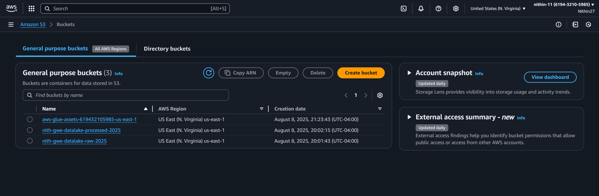
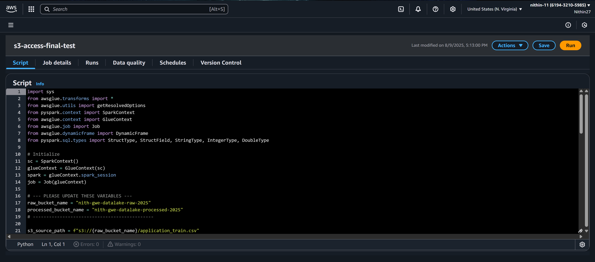
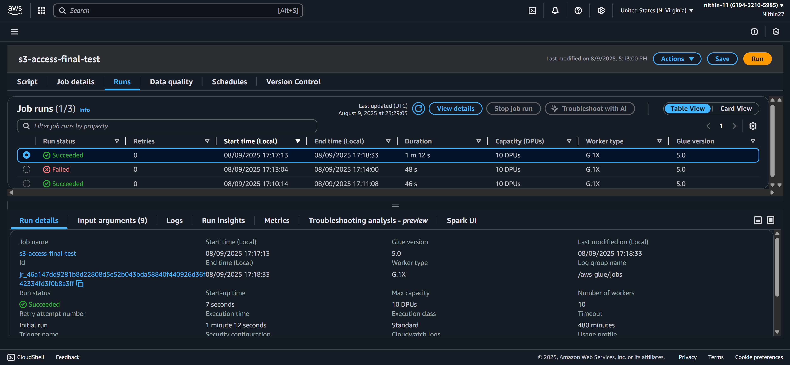
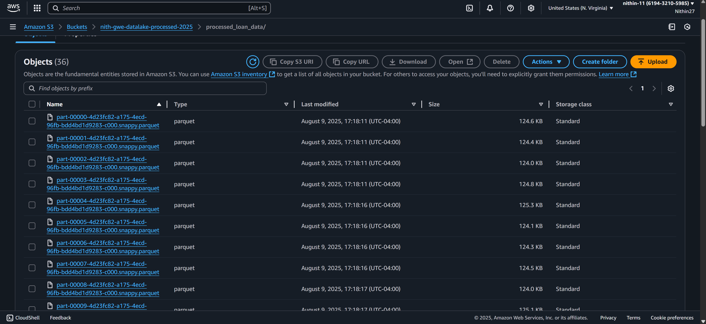
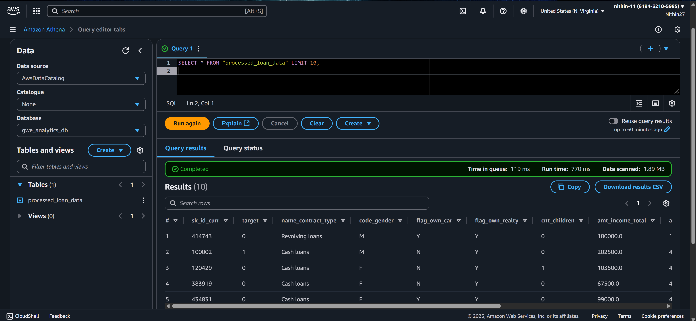

Project: End-to-End Financial Data ETL & Analytics Pipeline on AWS


1. Project Summary
   
This project demonstrates a complete, end-to-end, serverless data pipeline built on Amazon Web Services. The goal was to ingest a large, raw financial dataset (loan application data), process it through a scalable ETL (Extract, Transform, Load) job, store the cleaned data in an optimized format, and make it available for SQL querying and business intelligence visualization.

The pipeline successfully transforms a 150MB+ raw CSV file into a clean, partitioned Parquet dataset, which is then cataloged and analyzed to produce business insights. This project showcases core competencies in data engineering, cloud architecture, and data analysis using modern, industry-standard tools.

Core Technologies Used:

Data Lake Storage: Amazon S3

ETL Service: AWS Glue (with Apache Spark/PySpark)

Data Catalog: AWS Glue Data Catalog

Serverless SQL Querying: Amazon Athena

Business Intelligence: Amazon QuickSight

Permissions Management: AWS IAM

2. Solution Architecture:

The pipeline follows a modern data lake architecture, where data flows through distinct stages of processing and refinement.

Raw Data (S3) -> ETL Job (AWS Glue) -> Processed Data (S3) -> Metadata Catalog (Glue Crawler) -> SQL Queries (Athena) -> Dashboard (QuickSight)

Ingestion: The raw application_train.csv file is uploaded to a "raw" S3 bucket, which acts as the initial landing zone for our data lake.

Transformation: An AWS Glue job, running a custom PySpark script, is triggered. This job reads the raw data, applies a defined schema, cleans and transforms the data (e.g., selects key columns, fills missing values), and writes the result back to a "processed" S3 bucket.

Storage Optimization: The processed data is stored in the highly efficient, columnar Apache Parquet format, which is optimized for fast analytical querying.

Cataloging: An AWS Glue Crawler automatically scans the processed data in S3 and creates a metadata table definition in the AWS Glue Data Catalog. This makes the S3 files "discoverable" as a database table.

Analysis & Querying: Amazon Athena uses the Glue Data Catalog to run standard SQL queries directly on the Parquet files stored in S3, without needing to load them into a traditional database.

Visualization: Amazon QuickSight connects to Athena as a data source to create interactive dashboards and visualizations from the query results, providing business insights.

3. Step-by-Step Implementation

**Phase 1**: Setup and Data Ingestion
Two S3 buckets were created to form the data lake. The raw 158MB dataset was uploaded to the raw bucket.

**Phase 2:** ETL Pipeline with AWS Glue
A robust ETL pipeline was built using AWS Glue. A key challenge was overcoming a misleading PATH_NOT_FOUND error, which was resolved by creating a new IAM role with explicit AmazonS3FullAccess permissions, demonstrating real-world cloud debugging. The processed data was successfully written to the processed S3 bucket in the efficient Parquet format.

**Phase 3:** Data Cataloging and Querying
An AWS Glue Crawler cataloged the processed data, making it available for querying in Amazon Athena. A simple query was run to verify that the data was accessible and correctly formatted.

``` sql
SELECT * FROM "processed_loan_data" LIMIT 10;
```
#end of sql code

Phase 4: Business Intelligence and Visualization
Amazon QuickSight was connected to Athena to visualize the final dataset. A Tree Map was created to analyze the total loan amount by income type, broken down by default status.

**View the Final QuickSight Graphs (PDF)**


1. Final PySpark ETL Script

This is the final, production-ready script used in the successful AWS Glue job. It efficiently processes the large source file by providing a manually defined schema, which is a data engineering best practice.

```python

import sys
from awsglue.transforms import *
from awsglue.utils import getResolvedOptions
from pyspark.context import SparkContext
from awsglue.context import GlueContext
from awsglue.job import Job
from awsglue.dynamicframe import DynamicFrame
from pyspark.sql.types import StructType, StructField, StringType, IntegerType, DoubleType

# Initialize
sc = SparkContext()
glueContext = GlueContext(sc)
spark = glueContext.spark_session
job = Job(glueContext)

# --- Bucket names ---
raw_bucket_name = "nith-gwe-datalake-raw-2025"
processed_bucket_name = "nith-gwe-datalake-processed-2025"
# ---------------------------------------------

s3_source_path = f"s3://{raw_bucket_name}/application_train.csv"
s3_destination_path = f"s3://{processed_bucket_name}/processed_loan_data/"

try:
    # --- Step 1: Manually Define the Schema for the columns we need ---
    # This is the blueprint for our data, making the read fast and reliable.
    manual_schema = StructType([
        StructField("SK_ID_CURR", IntegerType(), True),
        StructField("TARGET", IntegerType(), True),
        StructField("NAME_CONTRACT_TYPE", StringType(), True),
        StructField("CODE_GENDER", StringType(), True),
        StructField("FLAG_OWN_CAR", StringType(), True),
        StructField("FLAG_OWN_REALTY", StringType(), True),
        StructField("CNT_CHILDREN", IntegerType(), True),
        StructField("AMT_INCOME_TOTAL", DoubleType(), True),
        StructField("AMT_CREDIT", DoubleType(), True),
        StructField("AMT_ANNUITY", DoubleType(), True),
        StructField("NAME_INCOME_TYPE", StringType(), True),
        StructField("NAME_EDUCATION_TYPE", StringType(), True)
    ])

    # --- Step 2: Read the CSV using the defined schema ---
    # This is the correct, standard Spark method.
    spark_df = spark.read.format("csv") \
        .option("header", "true") \
        .schema(manual_schema) \
        .load(s3_source_path)

    print("--- Successfully read data with manual schema. ---")
    
    # --- Step 3: DATA TRANSFORMATIONS ---
    # Fill missing values in the 'AMT_ANNUITY' column
    transformed_df = spark_df.fillna(0, subset=["AMT_ANNUITY"])
    
    print("--- Successfully transformed data. ---")
    
    # --- END OF TRANSFORMATIONS ---

    # Convert back to a Glue DynamicFrame before writing
    final_dynamic_frame = DynamicFrame.fromDF(transformed_df, glueContext, "final_dynamic_frame")

    # Write the transformed data to the processed S3 bucket in Parquet format
    glueContext.write_dynamic_frame.from_options(
        frame=final_dynamic_frame,
        connection_type="s3",
        connection_options={"path": s3_destination_path},
        format="parquet",
        transformation_ctx="write_to_s3"
    )
    
    print("--- Successfully wrote data to processed bucket! ---")

finally:
    job.commit()

```
#end of python code


5. Conclusion

This project successfully demonstrates the design, implementation, and debugging of a real-world data pipeline on AWS. It showcases the ability to handle large datasets, apply data transformations, and deliver clean, analysis-ready data for business intelligence purposes. The challenges faced and overcome, particularly with IAM permissions, highlight practical experience in troubleshooting complex cloud environments.

6. Project Visuals
   


**S3 Buckets for Data Lake:**


**Final PySpark Script in Glue Studio:**


**Successful Glue Job Run:**


**Processed Parquet Files in S3:**


**Athena Query Verification:**
